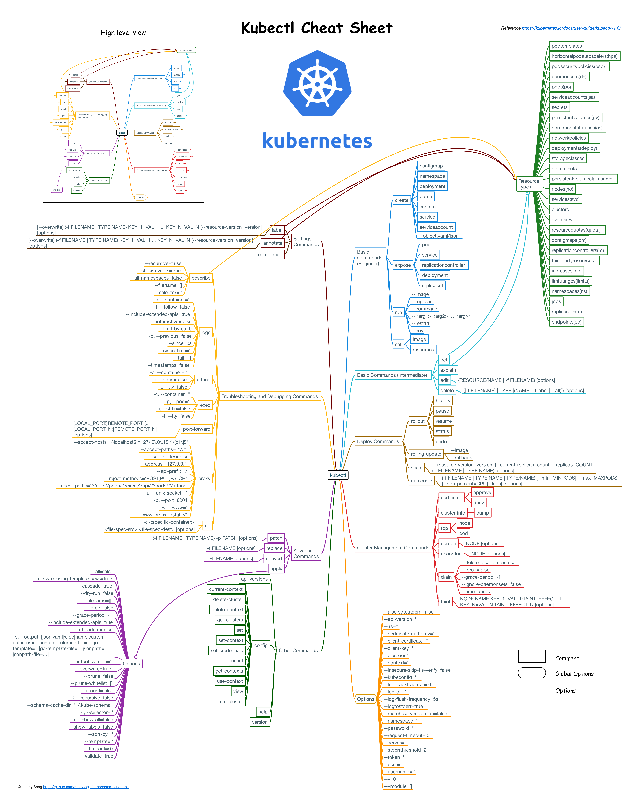
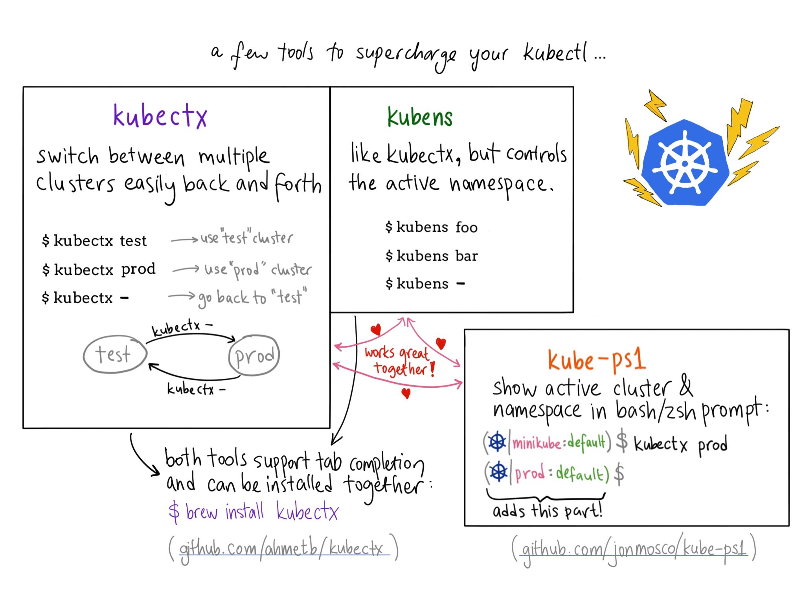
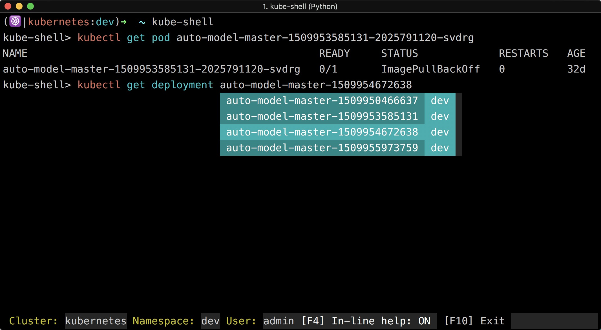

# kubectl命令概览

Kubernetes提供的kubectl命令是与集群交互最直接的方式，v1.6版本的kubectl命令参考图如下：



Kubectl的子命令主要分为8个类别：

* 基础命令（初学者都会使用的）
* 基础命令（中级）
* 部署命令
* 集群管理命令
* 故障排查和调试命令
* 高级命令
* 设置命令
* 其他命令

熟悉这些命令有助于大家来操作和管理kubernetes集群。

## 命令行提示

为了使用kubectl命令更加高效，我们可以选择安装一下开源软件来增加操作kubectl命令的快捷方式，同时为kubectl命令增加命令提示。



* [kubectx](https://github.com/ahmetb/kubectx)：用于切换kubernetes context
* [kube-ps1](https://github.com/jonmosco/kube-ps1)：为命令行终端增加`$PROMPT`字段
* [kube-shell](https://github.com/cloudnativelabs/kube-shell)：交互式带命令提示的kubectl终端

全部配置完成后的kubectl终端如下图所示：



### kube-shell

开源项目[kube-shell](https://github.com/cloudnativelabs/kube-shell)可以为kubectl提供自动的命令提示和补全，使用起来特别方便，推荐给大家。

Kube-shell有以下特性：

* 命令提示，给出命令的使用说明
* 自动补全，列出可选命令并可以通过tab键自动补全，支持模糊搜索
* 高亮
* 使用tab键可以列出可选的对象
* vim模式

**Mac下安装**

```bash
pip install kube-shell --user -U
```


## kubectl的身份认证

Kubernetes中存在三种安全认证方式：

* **CA证书**：API server与其它几个组件之间都是通过这种方式认证的
* **HTTP base**：即在API server的启动参数中指定的`--token-auth-file=/etc/kubernetes/token.csv`文件中明文的用户、组、密码和UID配置
* **bearer token**：HTTP请求中`header`中传递的`Autorization:Bearer token`，这个token通常保存在创建角色跟`serviceaccount`绑定的时候生成的secret中。

kubectl通过读取`kubeconfig`文件中的配置信息在向API server发送请求的时候同时传递认证信息，同时支持CA证书和bearer token的认证方式，请参考[使用kubeconfig文件配置跨集群认证](../access-kubernetes-cluster/authenticate-across-clusters-kubeconfig.md)。

## 终端下kubectl命令自动补全

建议使用[oh-my-zsh](http://ohmyz.sh/)，增加对kubectl命令自动补全支持。

修改`~/.zshrc`文件，增加如下两行：

```bash
plugins=(kubectl)
source <(kubectl completion zsh)
```

保存后重启终端即可生效。

参考：[Install and Set Up kubectl](https://kubernetes.io/docs/tasks/tools/install-kubectl/#using-zsh)

